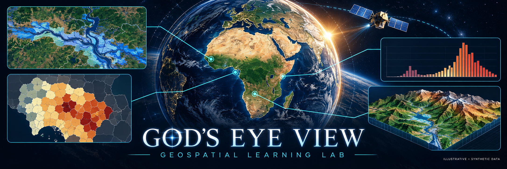
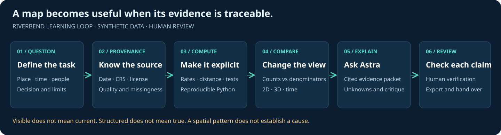
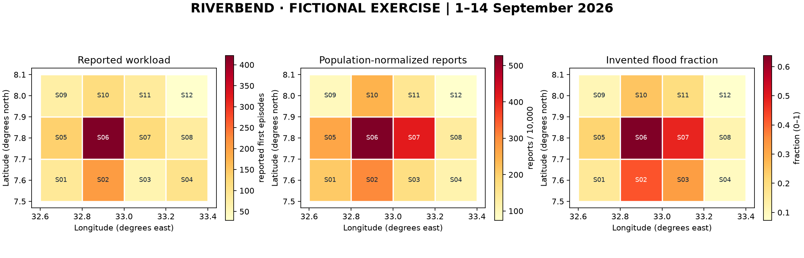

# God's Eye View · Geospatial Learning Lab

**From orbital intuition to a reviewed response exercise, entirely in a browser.**

Explore twelve executable notebooks and a fictional flood-and-outbreak exercise. Bring layers together, inspect uncertainty, and use GPT-6 Astra to help explain and critique reproducible analysis.

[**Launch JupyterLite**](https://jltobias.github.io/JupyterLite-Gods-Eye-View-Satellite/lite/lab/index.html) · <a href="_static/demos/riverbend-2d.html"><strong>2D EOC demo</strong></a> · <a href="_static/demos/riverbend-3d.html"><strong>3D scene demo</strong></a>

## Choose a learning path

| Path | Notebooks | Finish with |
|---|---|---|
| Satellite foundations · 60–90 min | 01 → 02 → 03 → 04 | Ground track, visibility and imagery context |
| Browser EOC · 2–3 hours | 05 → 07 → 09 → 12 | Operating picture, access scenario, 3D handover |
| Spatial epidemiology · 2–3 hours | 06 → 08 → 11 → 12 | Onset curve, rates, imagery provenance, uncertainty |
| Astra analyst · 60–90 min | 05 → 10 → 12 | Aggregate evidence packet and reviewed briefing |

Every lab includes objectives, inputs, exercises, checks, limitations, and sources. No API key is needed for computation. Optional live Astra use runs from a local terminal, outside the browser kernel.

## Three applications, distinct roles

**God's Eye View** is [Bilawal Sidhu's situational-awareness application](https://github.com/bilawalsidhu/gods-eye-view). This independent companion adds original notebooks and an optional layer adapter; it does not embed the whole upstream application in JupyterLite.

**NASA Worldview** is NASA's dated Earth-observation browser. Notebook 08 connects its imagery context and NASA GIBS requests to a provenance manifest. It is a separate product.

**JupyterLite** runs Python in your browser with Pyodide. This book also publishes executed outputs. Initial kernel startup downloads the runtime and compatible packages.

## Read the visuals critically

The same location can rank differently by count, rate, and assumed exposure. Riverbend sectors, clinics, populations, cases, and flood fractions are invented. Real Akobo is only the pre-existing map context; exercise results describe no real outbreak or community.

Start with [Getting started](getting-started.md) and [the exercise playbook](eoc-playbook.md). See [integration](integration.md), [glossary](glossary.md), and [attribution](attribution.md) as you work.
